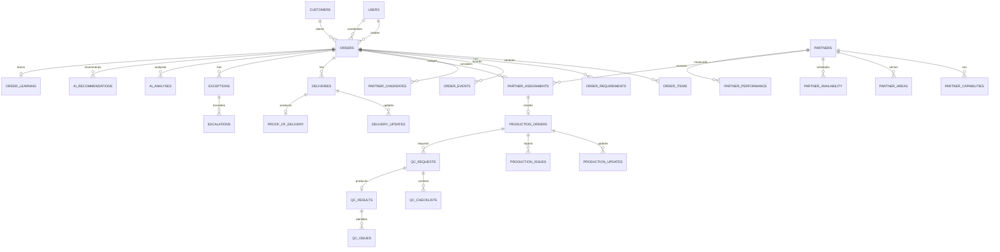

# FLORAOS COORDINATOR — DATABASE ARCHITECTURE

**Document ID:** FLORAOS-COORD-DB-001  
**Version:** 1.0  
**Status:** Canonical Draft  
**Database:** PostgreSQL / Supabase  
**Scope:** Coordinator Operations System  
**Last Updated:** 2026-09-25


> **IMPLEMENTATION CONTEXT — EXISTING SYSTEM EXTENSION**  
> Tài liệu này mô tả chức năng **Coordinator Operations** là một capability/module bổ sung vào **hệ thống FloraOS hiện có**, không phải một sản phẩm hoặc repository độc lập. Khi triển khai, AI Agent phải inspect repository hiện tại, tái sử dụng architecture, authentication, tenant model, database conventions, components, APIs, services và infrastructure đang có; không tạo một repo mới và không dựng lại các capability đã tồn tại.  
>  
> **Repository hiện tại là nguồn sự thật cho implementation detail.** Tài liệu này là canonical specification cho capability Coordinator. Nếu specification xung đột với behavior production hiện có, phải ưu tiên backward compatibility và ghi nhận gap/decision trước khi thay đổi behavior hiện hữu.  

---

## 1. Purpose

Tài liệu này định nghĩa kiến trúc Database chuẩn cho **FloraOS Coordinator Operations System**.

Database là lớp dữ liệu canonical phục vụ:

- Sales → Coordinator → Partner Shop → QC → Delivery → Closure.
- Order Control Tower.
- Coordinator User Journey.
- Template Architecture.
- AI Order Validation.
- AI Partner Matching.
- Production Monitoring.
- AI QC.
- Exception Management.
- Partner Performance.
- Order Learning.
- Analytics và automation.

### Nguyên tắc trung tâm

> **One Order Object → Multiple Views → Minimal Manual Touch**

`Order` là business object trung tâm. Các template, UI, AI output và Control Tower là các view/interaction trên dữ liệu canonical, không phải các nguồn dữ liệu độc lập.

---

# 2. Architecture Principles

## 2.1 Order-Centric

Mọi nghiệp vụ Coordinator phải truy ngược được về `order_id`.

```text
Customer
   ↓
Order
   ├── Requirements
   ├── Items
   ├── Partner Assignment
   ├── Production
   ├── QC
   ├── Delivery
   ├── Exceptions
   ├── Events
   ├── AI Analysis
   └── Learning
```

## 2.2 Template ≠ Database Table

Template chỉ là:

- communication artifact;
- UI projection;
- workflow form;
- partner-facing card;
- notification;
- report.

Không tạo một table riêng chỉ vì có một template.

Ví dụ:

```text
T07 Partner Production Card
        ↓
orders
+ order_items
+ order_requirements
+ partner_assignments
+ production_orders
+ production_updates
```

## 2.3 AI Output ≠ Business Decision

AI có thể:

- phân tích;
- dự đoán;
- đề xuất;
- cảnh báo;
- phân loại.

Nhưng các quyết định có tác động lớn phải có human approval trong MVP.

```text
AI Recommendation
        ↓
Human Decision
        ↓
Business Event
```

## 2.4 Event History Is Immutable

`order_events` là audit trail.

Không sửa lịch sử event để phản ánh trạng thái mới.

```text
Event 001 → Event 002 → Event 003 → Event 004
```

Current status được lưu để query nhanh; event history là nguồn audit.

## 2.5 Evidence-Based Completion

> "Đã báo" ≠ "Đã xử lý"

Một stage chỉ được coi là hoàn thành khi có:

- status phù hợp;
- owner;
- timestamp;
- evidence/result khi cần.

---

# 3. Recommended Technology

## 3.1 Primary Database

**PostgreSQL**.

Nếu triển khai theo stack FloraOS hiện tại:

```text
Frontend
   ↓
Next.js
   ↓
Application / API
   ↓
Supabase
   ├── PostgreSQL
   ├── Auth
   ├── Storage
   ├── RLS
   └── Realtime
```

## 3.2 Storage

Binary files không lưu trực tiếp trong PostgreSQL.

Lưu trong object storage:

- product images;
- production images;
- QC images;
- POD images;
- documents.

Database chỉ lưu:

```text
storage_path
file_url / signed reference
mime_type
file_size
metadata
```

---

# 4. Domain Architecture

Database được chia thành 10 domain.

| Domain | Core Tables |
|---|---|
| Identity | users, roles, user_roles |
| Customer | customers, customer_contacts |
| Order | orders, order_items, order_requirements |
| Partner | partners, partner_capabilities, partner_areas, partner_availability |
| Assignment | partner_candidates, partner_assignments |
| Production | production_orders, production_updates, production_issues |
| QC | qc_requests, qc_checklists, qc_results, qc_issues |
| Delivery | deliveries, delivery_updates, proof_of_delivery |
| Exception | exceptions, escalations |
| Intelligence | ai_analyses, ai_recommendations, order_learning, partner_performance |

Cross-cutting:

```text
order_events
attachments
comments
notifications
automation_runs
```

---

# 5. High-Level ERD



---

# 6. Identity Domain

## 6.1 users

```text
id                  UUID PK
full_name           TEXT
email               TEXT UNIQUE
phone               TEXT
status              user_status
avatar_url          TEXT
created_at          TIMESTAMPTZ
updated_at          TIMESTAMPTZ
```

Roles:

```text
ADMIN
SALES
COORDINATOR
QC
OPS
DELIVERY
FINANCE
PARTNER
```

## 6.2 roles

```text
id
code
name
description
```

## 6.3 user_roles

```text
user_id       FK users.id
role_id       FK roles.id
created_at
```

---

# 7. Customer Domain

## 7.1 customers

```text
id
customer_code
name
customer_type
status
notes
created_at
updated_at
```

## 7.2 customer_contacts

```text
id
customer_id
name
phone
email
role
is_primary
created_at
updated_at
```

---

# 8. Order Domain

## 8.1 orders

`orders` là canonical Order Object.

```text
id                      UUID PK
order_code              TEXT UNIQUE

customer_id             UUID FK
sales_user_id           UUID FK
coordinator_id          UUID FK

source                  order_source
source_reference        TEXT

status                  order_status
priority                order_priority

required_at             TIMESTAMPTZ
delivery_address        TEXT
delivery_lat            DECIMAL
delivery_lng            DECIMAL

recipient_name          TEXT
recipient_phone         TEXT

product_summary         TEXT
customer_note           TEXT
internal_note           TEXT

risk_level              risk_level
risk_reason             TEXT

next_action             TEXT
next_action_at          TIMESTAMPTZ
next_action_owner_id    UUID FK

created_at              TIMESTAMPTZ
updated_at              TIMESTAMPTZ
completed_at            TIMESTAMPTZ
```

### Không nên nhồi vào `orders`

Không đưa các cấu trúc lặp như:

- nhiều sản phẩm;
- nhiều requirement;
- nhiều partner candidate;
- nhiều event;
- nhiều production update;
- nhiều QC result

vào JSON hoặc column riêng nếu chúng cần query/relationship.

---

# 9. Order Lifecycle

Canonical lifecycle:

```text
NEW
 ↓
VALIDATING
 ↓
READY_FOR_PLANNING
 ↓
PLANNED
 ↓
FINDING_PARTNER
 ↓
PARTNER_PENDING
 ↓
PARTNER_CONFIRMED
 ↓
IN_PRODUCTION
 ↓
READY_FOR_QC
 ↓
QC_PENDING
 ↓
QC_PASSED
 ↓
READY_FOR_DELIVERY
 ↓
IN_DELIVERY
 ↓
DELIVERED
 ↓
CLOSING
 ↓
COMPLETED
```

Exception không nên thay thế lifecycle chính nếu có thể tránh.

Ví dụ:

```text
IN_PRODUCTION
+
EXCEPTION_OPEN
```

thay vì:

```text
EXCEPTION
```

---

# 10. order_items

```text
id
order_id                 FK
product_id               FK nullable

item_code
name
quantity
unit

specification            JSONB
customer_reference       TEXT

created_at
updated_at
```

`specification` có thể chứa:

```json
{
  "style": "romantic",
  "tone": "pastel",
  "flower_preference": ["rose", "hydrangea"],
  "budget": 800000,
  "size": "medium"
}
```

---

# 11. order_requirements

Đây là lớp structured requirement phục vụ AI và validation.

```text
id
order_id                 FK

requirement_type
requirement_key
value
value_type

source
confidence

is_required
is_confirmed

created_at
updated_at
```

Ví dụ:

```text
FLOWER
COLOR
STYLE
BUDGET
DELIVERY_TIME
DELIVERY_ADDRESS
RECIPIENT
CARD_MESSAGE
PACKAGING
SPECIAL_REQUEST
```

Ví dụ:

```json
{
  "requirement_key": "BUDGET",
  "value": "800000",
  "value_type": "NUMBER",
  "source": "AI",
  "confidence": 0.94,
  "is_confirmed": true
}
```

---

# 12. Partner Domain

## 12.1 partners

```text
id
partner_code
business_name
legal_name

phone
email

address
latitude
longitude

status
partner_tier

quality_score
reliability_score

created_at
updated_at
```

Partner tier có thể:

```text
GROW
CERTIFIED
PREMIUM
```

Không dùng tier để thay thế performance metrics.

---

# 13. partner_capabilities

```text
id
partner_id
capability_type

level
verified
verified_at
verified_by

created_at
updated_at
```

Capability examples:

```text
BOUQUET
FUNERAL_FLOWER
OPENING_FLOWER
WEDDING
EVENT
PREMIUM_FLOWER
CUSTOM_DESIGN
SAME_DAY
DELIVERY
```

---

# 14. partner_areas

```text
id
partner_id

province
district
ward

service_radius_km
priority

created_at
updated_at
```

---

# 15. partner_availability

```text
id
partner_id

date
start_time
end_time

capacity_units
available_capacity

status

created_at
updated_at
```

---

# 16. Partner Assignment

## 16.1 partner_candidates

```text
id
order_id
partner_id

match_score

capability_score
territory_score
availability_score
quality_score
sla_score
price_score

ai_reasoning

status

created_at
updated_at
```

Possible status:

```text
CANDIDATE
CONTACTED
ACCEPTED
DECLINED
EXPIRED
SELECTED
```

AI matching must store reasons, not only a score.

---

## 16.2 partner_assignments

```text
id
order_id
partner_id
candidate_id

assigned_by
assigned_at

confirmed_at

agreed_price
agreed_eta

status

created_at
updated_at
```

---

# 17. Production Domain

## 17.1 production_orders

```text
id
order_id
partner_assignment_id
partner_id

status

accepted_at
production_started_at
estimated_ready_at
actual_ready_at

agreed_price

partner_note
coordinator_note

created_at
updated_at
```

Production status:

```text
PENDING
ACCEPTED
DECLINED
IN_PRODUCTION
DELAY_RISK
READY
CANCELLED
```

---

## 17.2 production_updates

```text
id
production_order_id

status
progress_percent

message

reported_by
reported_at

created_at
```

---

## 17.3 production_issues

```text
id
production_order_id

issue_type
severity

description

reported_by
reported_at

resolution
resolved_by
resolved_at

status
```

Examples:

```text
MATERIAL_SHORTAGE
FLOWER_UNAVAILABLE
PRICE_CHANGE
CAPACITY_ISSUE
DELAY
DESIGN_ISSUE
OTHER
```

---

# 18. QC Domain

## 18.1 qc_requests

```text
id
order_id
production_order_id

requested_by
requested_at

status
completed_at
```

## 18.2 qc_checklists

```text
id
qc_request_id

check_type
required

created_at
```

Examples:

```text
FLOWER
COLOR
QUANTITY
SIZE
WRAPPING
RIBBON
CARD
PHOTO
GENERAL_APPEARANCE
```

## 18.3 qc_results

```text
id
qc_request_id

ai_result              JSONB
ai_confidence

human_decision
human_user_id

status
notes

created_at
updated_at
```

Human decision:

```text
PASS
FAIL
REWORK
REVIEW
```

## 18.4 qc_issues

```text
id
qc_result_id

issue_type
severity
description

evidence_url

resolution
resolved_at

created_at
```

---

# 19. Delivery Domain

## 19.1 deliveries

```text
id
order_id

delivery_type

pickup_address
delivery_address

recipient_name
recipient_phone

scheduled_at
pickup_at
delivered_at

status

driver_name
driver_phone

created_at
updated_at
```

Status:

```text
PENDING
READY
PICKUP_REQUESTED
PICKED_UP
IN_DELIVERY
DELIVERED
FAILED
CANCELLED
```

## 19.2 delivery_updates

```text
id
delivery_id

status
message
latitude
longitude

reported_by
created_at
```

## 19.3 proof_of_delivery

```text
id
delivery_id

photo_url
recipient_name
recipient_confirmation
signature_url
note

created_at
```

---

# 20. Exception Domain

## 20.1 exceptions

```text
id
order_id

exception_type
severity

detected_by
detected_at

description

owner_id

resolution
resolved_by
resolved_at

status

created_at
updated_at
```

Types:

```text
MISSING_INFORMATION
PARTNER_DECLINED
PARTNER_DELAY
MATERIAL_SHORTAGE
QC_FAILED
DELIVERY_DELAY
CUSTOMER_CHANGE
PRICE_CHANGE
SYSTEM_ERROR
OTHER
```

Severity:

```text
LOW
MEDIUM
HIGH
CRITICAL
```

## 20.2 escalations

```text
id
exception_id
order_id

from_user_id
to_user_id

reason
requested_action

status

created_at
resolved_at
```

---

# 21. Event Architecture

## 21.1 order_events

```text
id
order_id

event_type

from_status
to_status

actor_type
actor_id

metadata JSONB

created_at
```

Example:

```json
{
  "event_type": "PARTNER_CONFIRMED",
  "from_status": "PARTNER_PENDING",
  "to_status": "PARTNER_CONFIRMED",
  "actor_type": "COORDINATOR",
  "actor_id": "USR_001",
  "metadata": {
    "partner_id": "PT_023",
    "confirmed_price": 450000,
    "confirmed_eta": "2026-09-25T14:30:00"
  }
}
```

Event examples:

```text
ORDER_CREATED
ORDER_VALIDATED
ORDER_PLANNED
PARTNER_SEARCH_STARTED
PARTNER_CONTACTED
PARTNER_ACCEPTED
PARTNER_DECLINED
PRODUCTION_STARTED
PRODUCTION_DELAY_DETECTED
PRODUCTION_READY
QC_REQUESTED
QC_PASSED
QC_FAILED
REWORK_REQUESTED
DELIVERY_CREATED
DELIVERY_STARTED
DELIVERED
ORDER_COMPLETED
EXCEPTION_OPENED
EXCEPTION_RESOLVED
```

---

# 22. AI Domain

## 22.1 ai_analyses

```text
id
order_id nullable
entity_type
entity_id nullable

analysis_type

model
model_version
prompt_version

input_reference
output_json JSONB

confidence

created_at
```

Analysis types:

```text
ORDER_VALIDATION
ORDER_EXTRACTION
PARTNER_MATCHING
DELAY_PREDICTION
IMAGE_QC
MESSAGE_CLASSIFICATION
ORDER_SUMMARY
```

## 22.2 ai_recommendations

```text
id
order_id nullable

recommendation_type

recommendation JSONB
reasoning TEXT

confidence

accepted
rejected

decided_by
decided_at

created_at
```

Rule:

> Không ghi đè AI recommendation thành business fact.

---

# 23. Order Learning

## order_learning

```text
id
order_id

learning_type
signal
value JSONB

source

created_at
```

Examples:

```text
PARTNER_SELECTION
QC_PATTERN
DELAY_PATTERN
CUSTOMER_PREFERENCE
PRODUCT_PATTERN
PRICE_PATTERN
```

Learning chỉ nên được dùng làm training/optimization signal khi đủ dữ liệu và được kiểm soát.

---

# 24. Partner Performance

## partner_performance

```text
id
partner_id

period_start
period_end

orders_count
accepted_count
declined_count

on_time_count
late_count

qc_pass_count
qc_fail_count
rework_count

response_time_avg
production_time_avg

quality_score
sla_score
reliability_score

created_at
updated_at
```

Không chỉ lưu một `partner_score`.

Cần giữ raw metrics để có thể recalculation.

---

# 25. Attachments

## attachments

```text
id

entity_type
entity_id

file_type
storage_path

mime_type
file_size

uploaded_by

metadata JSONB

created_at
```

Ví dụ:

```text
ORDER
PRODUCTION
QC
DELIVERY
POD
EXCEPTION
PARTNER
```

---

# 26. Comments / Communication

## comments

```text
id

entity_type
entity_id

author_type
author_id

message

channel

created_at
```

Channel:

```text
INTERNAL
PARTNER
CUSTOMER
SYSTEM
```

Không dùng `comments` thay thế structured business data.

---

# 27. Notifications

## notifications

```text
id
user_id

type
title
message

entity_type
entity_id

priority

read_at
created_at
```

---

# 28. Automation Runs

## automation_runs

```text
id

automation_type
entity_type
entity_id

trigger
status

input_json
output_json

started_at
completed_at

error_message
```

Status:

```text
PENDING
RUNNING
SUCCESS
FAILED
CANCELLED
```

Dùng để audit automation và tránh chạy trùng.

---

# 29. Control Tower

Control Tower nên là **derived view**, không phải source table.

Conceptual view:

```sql
CREATE VIEW coordinator_control_tower AS
SELECT
    o.id,
    o.order_code,
    o.status,
    o.priority,
    o.required_at,
    o.risk_level,
    o.next_action,
    o.next_action_at,
    o.coordinator_id
FROM orders o
WHERE o.status <> 'COMPLETED';
```

Production, QC, delivery và exception có thể được join vào view/materialized view tùy performance.

Control Tower cần hiển thị:

```text
STATUS
NEXT ACTION
OWNER
RISK
DEADLINE
```

---

# 30. Index Strategy

Indexes quan trọng:

```text
orders(order_code)
orders(status)
orders(coordinator_id, status)
orders(required_at)
orders(risk_level)
orders(next_action_at)

order_items(order_id)
order_requirements(order_id, requirement_key)

order_events(order_id, created_at)

partner_candidates(order_id)
partner_candidates(partner_id)

partner_assignments(order_id)
partner_assignments(partner_id)

production_orders(order_id)
production_orders(partner_id, status)
production_orders(estimated_ready_at)

production_updates(production_order_id, created_at)

qc_requests(order_id)
qc_results(qc_request_id)

deliveries(order_id)
deliveries(status, scheduled_at)

exceptions(order_id, status)
exceptions(owner_id, status)

ai_analyses(order_id, analysis_type)

partner_performance(partner_id, period_start)
```

Các index thực tế cần được kiểm chứng bằng query plan khi traffic tăng.

---

# 31. JSONB Rules

JSONB được phép dùng cho:

- AI output;
- dynamic product specification;
- metadata;
- model input/output;
- extensible attributes.

Không dùng JSONB cho dữ liệu cần:

- thường xuyên filter;
- join;
- aggregate;
- authorization;
- critical business rules.

Ví dụ không nên:

```text
orders.data JSONB
```

chứa toàn bộ Order.

Nên:

```text
orders
order_items
order_requirements
...
```

và chỉ dùng JSONB ở nơi có tính biến động cao.

---

# 32. Security / RLS

Nếu dùng Supabase:

- bật RLS cho business tables;
- user chỉ được đọc dữ liệu thuộc tenant/organization được phép;
- Coordinator chỉ truy cập orders được phân quyền;
- Partner chỉ nhìn thấy production/order data liên quan đến mình;
- Customer-facing data phải tách khỏi internal notes;
- AI logs không mặc định public;
- PII cần hạn chế quyền truy cập.

Conceptual tenant boundary:

```text
organization
   ↓
users
   ↓
orders / partners / customers
```

Nếu FloraOS hỗ trợ multi-tenant SaaS, `organization_id` nên xuất hiện ở các aggregate/business tables ngay từ đầu.

---

# 33. Multi-Tenant Recommendation

Nếu FloraOS là SaaS cho nhiều doanh nghiệp:

```text
organizations
    │
    ├── users
    ├── customers
    ├── partners
    ├── orders
    ├── products
    └── configurations
```

Các bảng business chính nên có:

```text
organization_id UUID FK
```

Không nên phụ thuộc vào application logic để xác định tenant.

RLS phải enforce tenant boundary ở database layer.

---

# 34. Timestamps & Versioning

Mọi transactional table nên có:

```text
created_at
updated_at
```

Các lifecycle entities nên có thêm:

```text
accepted_at
started_at
completed_at
resolved_at
```

Không dùng một `updated_at` duy nhất để suy luận lịch sử.

Lịch sử phải lấy từ:

```text
order_events
production_updates
delivery_updates
exceptions
```

---

# 35. Idempotency

Các operation có thể được retry phải có idempotency protection.

Ví dụ:

```text
POST /orders
POST /partner-assignments
POST /delivery
POST /notifications
```

Có thể dùng:

```text
idempotency_key
```

hoặc unique business key.

Mục tiêu:

> Retry ≠ duplicate business action.

---

# 36. Template → Database Mapping

| Template | Primary Data |
|---|---|
| T01 Sales Order Intake | orders, order_items, requirements |
| T02 Sales Order Brief | orders, requirements |
| T03 Missing Information Request | order_requirements, comments |
| T04 Order Change Request | order_events, requirements |
| T05 Coordinator Order Card | orders + related entities |
| T06 Partner Candidate Card | partner_candidates, partners |
| T07 Partner Production Card | orders, production_orders, requirements |
| T08 Partner Acceptance | partner_assignments, production_orders |
| T09 Partner Question | comments, order_requirements |
| T10 Production Status Update | production_updates, order_events |
| T11 Production Issue Report | production_issues, exceptions |
| T12 Production Completion | production_orders, production_updates |
| T13 QC Request | qc_requests |
| T14 QC Checklist | qc_checklists |
| T15 AI QC Report | ai_analyses, qc_results |
| T16 Rework Request | qc_issues, production_issues, exceptions |
| T17 Replacement Request | exceptions, partner_assignments |
| T18 Delivery Card | deliveries |
| T19 Pickup Request | deliveries, delivery_updates |
| T20 Delivery Status | delivery_updates |
| T21 POD | proof_of_delivery |
| T22 Exception Card | exceptions |
| T23 Escalation Request | escalations |
| T24 Partner Replacement | partner_candidates, assignments |
| T25 Order Completion | orders, order_events |
| T26 Partner Performance Record | partner_performance |
| T27 Order Learning Record | order_learning |

---

# 37. User Journey → Database

## Stage 1 — Sales creates order

```text
orders
order_items
order_requirements
order_events
```

## Stage 2 — AI validates

```text
ai_analyses
order_requirements
exceptions
```

## Stage 3 — Coordinator plans

```text
orders
order_events
```

## Stage 4 — Partner matching

```text
partner_candidates
partners
partner_capabilities
partner_areas
partner_availability
```

## Stage 5 — Partner confirms

```text
partner_assignments
production_orders
order_events
```

## Stage 6 — Production

```text
production_updates
production_issues
exceptions
```

## Stage 7 — QC

```text
qc_requests
qc_checklists
qc_results
qc_issues
ai_analyses
```

## Stage 8 — Delivery

```text
deliveries
delivery_updates
proof_of_delivery
```

## Stage 9 — Closure

```text
orders
order_events
partner_performance
order_learning
```

---

# 38. Coordinator Operating Model

Database phải hỗ trợ ba mode:

```text
MONITOR
   ↓
ACT
   ↓
RESOLVE
```

## Monitor

Query:

```text
orders
+
production
+
delivery
+
exceptions
```

## Act

Create/update:

```text
partner_assignments
production_updates
qc_requests
deliveries
```

## Resolve

Create:

```text
exceptions
escalations
replacement assignments
rework requests
```

---

# 39. Business Rules

## Rule 1

Every active order must have:

```text
status
owner
next_action
deadline
```

## Rule 2

Every status transition must generate an event.

```text
UPDATE orders.status
+
INSERT order_events
```

## Rule 3

High-impact AI recommendation requires human decision.

## Rule 4

Completed order must have required evidence.

Depending on flow:

```text
QC evidence
Delivery evidence
POD
completion event
```

## Rule 5

Partner performance must be calculated from actual order events, not manual subjective scoring only.

## Rule 6

Historical events are immutable.

## Rule 7

Do not duplicate canonical information across templates.

---

# 40. MVP Database Scope

MVP should prioritize:

```text
users
customers
orders
order_items
order_requirements

partners
partner_capabilities
partner_areas
partner_availability

partner_candidates
partner_assignments

production_orders
production_updates

qc_requests
qc_checklists
qc_results

deliveries
delivery_updates
proof_of_delivery

exceptions
escalations

order_events

ai_analyses
ai_recommendations

attachments
notifications
```

---

# 41. P1

Add:

```text
production_issues
qc_issues
partner_performance
order_learning
automation_runs
comments

advanced Control Tower views
delay prediction
AI partner matching
AI QC
```

---

# 42. P2

Add:

```text
capacity forecasting
dynamic partner pricing
advanced learning engine
multi-order optimization
route optimization
partner incentive engine
predictive demand
cross-order analytics
```

---

# 43. API / Service Boundary

Recommended service boundaries:

```text
Order Service
Partner Service
Assignment Service
Production Service
QC Service
Delivery Service
Exception Service
AI Service
Analytics Service
Notification Service
```

Do not create microservices prematurely.

MVP can be a modular monolith:

```text
Next.js / Backend
        │
        ├── Order Module
        ├── Partner Module
        ├── Production Module
        ├── QC Module
        ├── Delivery Module
        ├── Exception Module
        └── AI Module
                │
                ↓
          PostgreSQL
```

Database domain boundaries should be clear even if application deployment is initially one service.

---

# 44. Migration Strategy

Every schema change must be versioned.

Example:

```text
001_initial_schema
002_add_order_requirements
003_add_partner_matching
004_add_production
005_add_qc
006_add_delivery
007_add_ai_analysis
```

Never manually alter production schema without migration.

Recommended:

```text
Migration
 ↓
Review
 ↓
Test
 ↓
Apply
 ↓
Verify
```

---

# 45. Seed / Reference Data

Reference data should be centralized.

Examples:

```text
order_statuses
order_priorities
partner_capabilities
exception_types
qc_check_types
delivery_statuses
user_roles
```

Where values are stable and business-critical, prefer controlled enums/reference tables over arbitrary strings.

---

# 46. Data Retention

Recommended policy:

### Operational data

Retain according to commercial/legal requirements.

### Event data

Keep long-term where feasible because it powers:

- audit;
- analytics;
- learning;
- performance.

### AI logs

Retention should be configurable.

### Temporary automation logs

Can have shorter retention.

Do not delete business evidence solely to reduce database size without an approved retention policy.

---

# 47. Canonical Data Flow

```text
SALES
  │
  ▼
ORDER OBJECT
  │
  ├── AI VALIDATION
  │
  ▼
COORDINATOR
  │
  ▼
PARTNER MATCHING
  │
  ▼
PARTNER ASSIGNMENT
  │
  ▼
PRODUCTION
  │
  ▼
QC
  │
  ▼
DELIVERY
  │
  ▼
POD
  │
  ▼
COMPLETION
  │
  ├── PARTNER PERFORMANCE
  └── ORDER LEARNING
```

Every major transition generates:

```text
Business State
+
Event
+
Evidence
```

---

# 48. Canonical Rules for AI Coding Agents

AI coding agents must follow these rules when implementing FloraOS.

## Rule 01 — Order is canonical

Do not create alternative order representations as independent sources of truth.

## Rule 02 — Template is not a table

Do not create a table merely because a template exists.

## Rule 03 — Event every transition

Any important lifecycle transition must create an immutable event.

## Rule 04 — Preserve history

Never overwrite historical business facts when a new event should be appended.

## Rule 05 — AI is advisory by default

AI output must be stored separately from confirmed business decisions.

## Rule 06 — Human approval

High-impact decisions require explicit human approval unless a future policy explicitly authorizes automation.

## Rule 07 — Structured data first

If data needs to be queried, filtered, joined or aggregated, do not hide it inside arbitrary JSONB.

## Rule 08 — JSONB for variability

Use JSONB for AI output, metadata and genuinely dynamic structures.

## Rule 09 — Evidence-based completion

Do not mark a workflow complete without required evidence.

## Rule 10 — No duplicate source of truth

If a value already exists canonically, reference it rather than copying it into another entity.

## Rule 11 — Tenant isolation

If multi-tenant, every business query must respect `organization_id` and RLS.

## Rule 12 — Idempotency

Retries must not create duplicate business actions.

## Rule 13 — Auditability

A human must be able to reconstruct what happened to an order.

## Rule 14 — Explain AI

AI recommendations should store sufficient reasoning/metadata to understand why they were generated.

## Rule 15 — Progressive implementation

Implement:

```text
Schema
→ Domain Model
→ API
→ Workflow
→ UI
→ Automation
→ AI
```

Do not start by building UI-only state that has no canonical database representation.

---

# 49. Definition of Done — Database

Database architecture is considered implementation-ready when:

- [ ] ERD is reviewed.
- [ ] All MVP tables are defined.
- [ ] PK/FK relationships are defined.
- [ ] Lifecycle enums are defined.
- [ ] RLS/tenant strategy is defined.
- [ ] Required indexes are defined.
- [ ] Event model is implemented.
- [ ] Audit trail is tested.
- [ ] Idempotency strategy is implemented.
- [ ] Storage strategy is implemented.
- [ ] Migration system is configured.
- [ ] Seed/reference data is defined.
- [ ] Template mapping is validated.
- [ ] User Journey mapping is validated.
- [ ] Control Tower queries are tested.
- [ ] AI output is separated from human decisions.
- [ ] Completion evidence rules are tested.

---

# 50. Final Architecture

The canonical FloraOS Coordinator data architecture is:

```text
                    ┌────────────────────┐
                    │    ORGANIZATION    │
                    └─────────┬──────────┘
                              │
                    ┌─────────▼──────────┐
                    │       USERS        │
                    └─────────┬──────────┘
                              │
              ┌───────────────▼───────────────┐
              │             ORDER             │
              │        CANONICAL OBJECT       │
              └───────────────┬───────────────┘
                              │
       ┌──────────────┬───────┼────────┬──────────────┐
       ▼              ▼       ▼        ▼              ▼
 Requirements       Items   Partner  Production       Events
                               │         │
                               │         ▼
                               │         QC
                               │         │
                               │         ▼
                               │      Delivery
                               │         │
                               │         ▼
                               │        POD
                               │
                               ▼
                           Performance

       ┌─────────────────────────────────────────────┐
       │                 INTELLIGENCE                │
       │                                             │
       │ AI Analysis → Recommendation → Human       │
       │ Decision → Event → Learning                │
       └─────────────────────────────────────────────┘

       ┌─────────────────────────────────────────────┐
       │                EXCEPTION LAYER              │
       │ Missing Info / Delay / QC / Delivery /     │
       │ Partner / Customer / Escalation            │
       └─────────────────────────────────────────────┘
```

## Canonical statement

> **FloraOS Database không chỉ lưu đơn hàng. Nó lưu toàn bộ trạng thái, quyết định, hành động, bằng chứng và lịch sử của một đơn hàng từ lúc Sales tạo đơn đến khi đơn hoàn tất — để Coordinator có thể điều hành bằng Control Tower, AI có thể hỗ trợ ra quyết định, automation có thể xử lý công việc lặp lại, và hệ thống có thể học từ dữ liệu thực tế.**

---

**End of Document**
