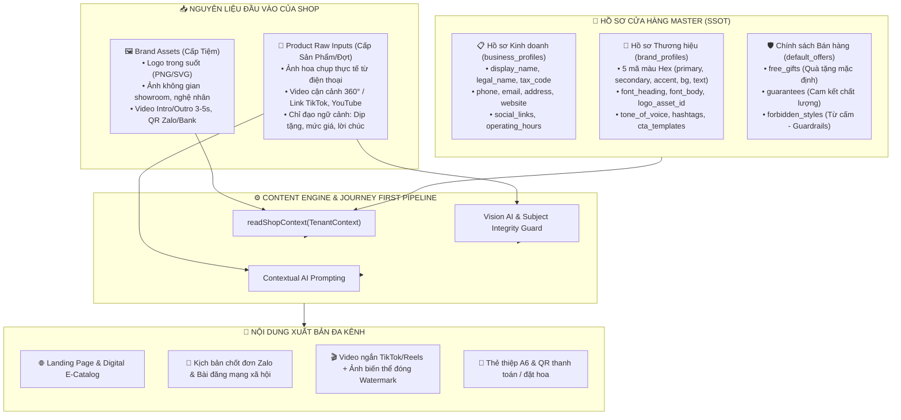

# ĐẶC TẢ KIẾN TRÚC HỒ SƠ CỬA HÀNG & NGUYÊN LIỆU ĐẦU VÀO (BUSINESS PROFILE & RAW INPUT SPECIFICATION)

**Hệ thống:** `floraos-core`  
**Cấp độ:** Kiến trúc Đặc tả Kỹ thuật & Nghiệp vụ (SSOT)  
**Phạm vi:** Hồ sơ Cửa hàng (Business & Brand Profile), Nguyên liệu Đa phương tiện (Raw Inputs), và Pipeline Tạo Nội dung  
**Ngôn ngữ tài liệu & UI:** 100% Tiếng Việt  
**Trạng thái:** Hoàn thiện — Sẵn sàng Thực thi  

---

## 1. MỤC TIÊU & NGUYÊN TẮC THIẾT KẾ

Trong hệ thống FloraOS, **Hồ sơ Cửa hàng (Business Profile)** không đơn thuần là một bảng cài đặt tài khoản thông thường, mà đóng vai trò là **Nguồn Chân Lý Duy Nhất (Single Source of Truth — SSOT)** về nhận diện thương hiệu, pháp lý và phong cách vận hành của mỗi tiệm hoa (Tenant).

### Các nguyên tắc cốt lõi:
1. **Thiết lập Một lần — Sử dụng Xuyên suốt (Single Entry, System-wide Reuse)**: Chủ cửa hàng chỉ cần cấu hình hồ sơ một lần. Hệ thống tự động nạp dữ liệu này vào tất cả các phân hệ: Tạo Landing Page, Digital Catalog, Xưởng sản xuất Video/Hình ảnh (Media AI Studio), Kịch bản tư vấn Zalo, Thẻ in thiệp mừng A6.
2. **Tách biệt Dữ liệu Pháp lý & Dữ liệu Tạo sinh (Legal vs Generative Separation)**:
   - *Hồ sơ Kinh doanh (`business_profiles`)*: Quản lý thông tin liên hệ, pháp lý, địa điểm, kênh kết nối khách hàng.
   - *Hồ sơ Thương hiệu (`brand_profiles`)*: Quản lý bộ nhận diện thị giác (Design Tokens: 5 mã màu Hex, logo, typography) và phong cách nội dung (Tone of voice, hashtag, rào chắn từ cấm).
3. **Phân cấp Nguyên liệu Đầu vào (Layered Inputs Architecture)**:
   - *Nguyên liệu cấp Thương hiệu (Brand Master Assets)*: Tải lên một lần (Logo trong suốt, ảnh không gian tiệm, video intro/outro).
   - *Nguyên liệu cấp Chiến dịch/Sản phẩm (Campaign/Product Raw Inputs)*: Tải lên theo từng đợt tạo nội dung (Ảnh hoa thực tế, video quay 360°, ghi chú dịp tặng, giá bán).

---

## 2. KIẾN TRÚC DỮ LIỆU TẬP TRUNG (DATA ARCHITECTURE)



---

## 3. CẤU TRÚC CHI TIẾT CÁC TRƯỜNG THÔNG TIN (FIELDS SPECIFICATION)

### 3.1. Bảng `business_profiles` (Hồ sơ Kinh doanh & Liên hệ)

Quản lý thông tin định danh pháp lý và các kênh tương tác của tiệm với khách hàng.

| Tên trường | Kiểu dữ liệu | Bắt buộc | Mô tả & Quy chuẩn | Ứng dụng khi tạo nội dung |
| :--- | :--- | :---: | :--- | :--- |
| `display_name` | `String` | **Có** | Tên thương hiệu hiển thị (VD: *Tiệm Hoa Tươi Mộc Lan*). Không được để trống. | Xuất hiện trên Hero Banner, Header, Watermark chữ, chữ ký bài viết. |
| `legal_name` | `String?` | Không | Tên đầy đủ trên ĐKKD / Công ty / Hộ kinh doanh. | In trên hóa đơn bán lẻ, chứng từ thanh toán và điều khoản dịch vụ. |
| `tax_code` | `String?` | Không | Mã số thuế (chuỗi số 10 hoặc 13 chữ số). | Khẳng định uy tín pháp nhân ở chân trang Landing Page. |
| `description` | `String?` | Không | Định vị ngắn gọn về phong cách của tiệm (1–2 câu). | Cung cấp ngữ cảnh xuất phát điểm cho AI viết lời giới thiệu tiệm (About Us). |
| `phone` | `String?` | Khuyến nghị | Hotline hoặc Số điện thoại Zalo tư vấn chính. | Tự động gắn vào nút bấm CTA *"Gọi điện"* hoặc link chat nhanh Zalo. |
| `email` | `String?` | Không | Email hỗ trợ khách hàng (kiểm tra định dạng email hợp lệ). | Gửi thông báo xác nhận đơn đặt hàng từ trang Landing Page. |
| `address` | `String?` | Khuyến nghị | Địa chỉ showroom hoặc xưởng hoa chính. | Tích hợp vào bản đồ địa chỉ, tính phí giao hàng và chân trang website. |
| `website` | `String?` | Không | Link trang web chính của cửa hàng (nếu có). | Đặt link liên kết chéo trên các kênh. |
| `operating_hours` | `Json?` | Khuyến nghị | Cấu trúc `{ open: "08:00", close: "21:30" }`. | Hiển thị khung giờ phục vụ khách hàng trên trang đặt hoa. |
| `social_links` | `Json?` | Khuyến nghị | Cấu trúc `{ facebook: string, zalo: string, instagram: string, tiktok: string }`. | Tự động sinh hàng icon mạng xã hội ở chân trang Landing Page và Catalog. |

---

### 3.2. Bảng `brand_profiles` (Hồ sơ Nhận diện Thương hiệu & Quy tắc Tạo sinh)

Bộ thông số kỹ thuật quyết định diện mạo thị giác (Visual Theme) và phong cách ngôn từ (Voice) của AI.

#### A. Bộ 5 Mã Màu Hex Chuẩn Nhận Diện (Design Tokens)
FloraOS chuẩn hóa hệ thống 5 màu Hex để giao diện tự động dựng luôn hài hòa, tuyệt đối không để AI đoán màu bừa bãi:

1. **`primary_color` (Màu chủ đạo)**: Nút hành động chính (CTA Button), thanh tiêu đề nổi bật, viền khung quan trọng (Mặc định: `#e11d48`).
2. **`secondary_color` (Màu phụ)**: Huy hiệu (badge), thẻ phân loại phụ, nhãn trạng thái ưu đãi (Mặc định: `#fda4af`).
3. **`accent_color` (Màu nhấn)**: Giá khuyến mãi sốt dẻo, sao đánh giá, điểm nhấn thị giác (Mặc định: `#f59e0b`).
4. **`background_color` (Màu nền trang)**: Màu nền toàn bộ Landing Page và E-Catalog, chống lệch tông giao diện (Mặc định: `#ffffff`).
5. **`text_color` (Màu chữ chính)**: Màu văn bản nội dung, đảm bảo độ tương phản cao đạt chuẩn WCAG 2.2 AA (Mặc định: `#111827`).

#### B. Kiểu chữ & Tông giọng (Typography & Tone of Voice)
- **`font_heading`**: Phông chữ cho tiêu đề lớn (VD: *Playfair Display* cho phong cách cổ điển, sang trọng; *Inter* cho phong cách hiện đại, tối giản; *Montserrat* cho phong cách trẻ trung).
- **`font_body`**: Phông chữ cho nội dung mô tả (VD: *Inter*, *Merriweather*).
- **`tone_of_voice`**: Giọng điệu của nội dung AI sinh ra:
  - `romantic`: Thơ mộng, lãng mạn, bay bổng (hoa tình yêu, hoa cầu hôn, Valentine, 8/3).
  - `luxury`: Sang trọng, chỉn chu, đẳng cấp (hoa chúc mừng đối tác, đại hội, khai trương doanh nghiệp).
  - `warm`: Ấm áp, gần gũi, chân thành (hoa tặng mẹ, gia đình, sinh nhật người thân).
  - `modern`: Trẻ trung, bắt trend, năng động (hoa tặng bạn bè, tốt nghiệp).
- **`hashtags`**: Mảng thẻ định danh thương hiệu (JSON `{ default: string[] }`, ví dụ: `["#HoaTuoiMocLan", "#TiemHoaQuan1", "#HoaThietKe"]`).
- **`cta_templates`**: Câu kêu gọi hành động chuẩn thương hiệu (JSON `{ default: string }`, ví dụ: *"Ghé tiệm hoặc nhắn Zalo để nghệ nhân Mộc Lan tư vấn mẫu hoa độc bản cho bạn!"*).

---

### 3.3. Chính sách Bán hàng & Rào chắn Ngôn từ (`default_offers` & `forbidden_styles`)

1. **`default_offers.free_gifts` (Quà tặng kèm mặc định)**:
   - Danh sách quà tặng được cấu hình thành mảng độc lập:
     - *Thiệp chúc mừng thiết kế mỹ thuật cao cấp*.
     - *Banner in thông điệp chúc mừng theo yêu cầu*.
     - *Gói dưỡng hoa tươi lâu nhập khẩu*.
2. **`default_offers.guarantees` (Cam kết chất lượng dịch vụ)**:
   - Danh sách cam kết uy tín:
     - *100% hoa tươi loại 1 nhập mới trong ngày*.
     - *Gửi hình ảnh chụp thực tế thành phẩm trước khi giao hoa*.
     - *Hoàn tiền 100% hoặc đổi mới nếu hoa dập nát, héo úa khi nhận hàng*.
3. **`forbidden_styles.banned_words` (Rào chắn từ cấm — AI Guardrail)**:
   - Danh sách từ ngữ cấm AI đưa vào bài viết để tránh hạ thấp giá trị thương hiệu hoa thiết kế (VD: `["hoa rẻ", "xả hàng tồn", "phá giá", "giá rẻ nhất thị trường", "bán tống bán tháo"]`).

---

## 4. CHI TIẾT CÁC NGUYÊN LIỆU ĐẦU VÀO (INPUTS) CHỦ CỬA HÀNG CẦN ĐƯA LÊN

Để tạo thành một Landing Page, Catalog hay chiến dịch truyền thông đa kênh, chủ tiệm cung cấp nguyên liệu theo **2 tầng rõ ràng**:

```text
TẦNG 1: NGUYÊN LIỆU CẤP THƯƠNG HIỆU (Tải lên 1 lần tại trang Hồ sơ Cửa hàng)
├── 1. Logo chính thức của shop (PNG trong suốt / SVG / JPG nét cao)
├── 2. Ảnh không gian cửa hàng & Nghệ nhân cắm hoa (2–4 ảnh chất lượng cao)
├── 3. Video ngắn nhận diện / Intro & Outro (3–5s)
└── 4. Ảnh mã QR Zalo & Ngân hàng nhận thanh toán

TẦNG 2: NGUYÊN LIỆU THEO TỪNG ĐỢT TẠO NỘI DUNG (Tải lên tại luồng tạo Landing/Catalog)
├── 1. Ảnh hoa thực tế chụp từ điện thoại (Product Master Images)
├── 2. Video sản phẩm quay cận cảnh 360° hoặc Đường link TikTok / YouTube
├── 3. Giá bán thực tế & Giá gốc khuyến mãi (Price & Original Price)
└── 4. Ghi chú chỉ đạo ngữ cảnh (Dịp tặng, phong cách, thông điệp người mua muốn gửi)
```

### 4.1. Chi tiết Tầng 1: Nguyên liệu Nhận diện Cấp Thương hiệu

1. **Logo chính thức (`logo_asset_id`)**:
   - **Quy cách**: File ảnh PNG nền trong suốt (khuyến nghị) hoặc SVG/JPG chất lượng cao, kích thước tối thiểu `512x512px`.
   - **Tác vụ hệ thống**:
     - *Đóng Watermark bản quyền*: Worker Media AI tự động lấy logo này đóng mờ tinh tế vào góc ảnh sản phẩm đã dựng cảnh và video tiếp thị. Nếu chưa có logo, hệ thống tự động lùi về tên tiệm (`display_name`).
     - *Thanh điều hướng (Navbar)*: Hiển thị góc trên bên trái của Landing Page và Catalog.
     - *In thiệp*: In vào góc chân trang của Thẻ chào hàng/Thiệp hoa A6.
2. **Ảnh Không gian Cửa hàng & Nghệ nhân (Storefront & Florist Photos)**:
   - **Quy cách**: 2–4 ảnh ngang tỷ lệ 16:9 hoặc 4:3, độ phân giải tối thiểu 1920x1080px.
   - **Tác vụ hệ thống**: Sử dụng làm ảnh nền Hero Banner, khối câu chuyện thương hiệu ("Về Chúng Tôi"), tạo sự tin cậy tuyệt đối cho khách mua hoa online.
3. **Video Intro / Outro hoặc Video Không gian Showroom (Tùy chọn)**:
   - **Quy cách**: Video ngắn 3–5 giây, tỷ lệ 9:16 (dọc) hoặc 16:9 (ngang), định dạng MP4.
   - **Tác vụ hệ thống**: Tự động ghép vào đầu hoặc cuối các video quay sản phẩm hoa để biến video thô thành video tiếp thị chuẩn nhận diện thương hiệu trên Reels/TikTok.
4. **Ảnh Mã QR Zalo / Ngân hàng của Shop**:
   - **Quy cách**: Ảnh vuông rõ nét, không bị mờ nhòe mã ma trận.
   - **Tác vụ hệ thống**: Nhúng trực tiếp vào popup thanh toán nhanh hoặc nút quét kết nối Zalo với chủ shop.

---

### 4.2. Chi tiết Tầng 2: Nguyên liệu Đầu vào theo Đợt (Chiến dịch / Sản phẩm)

Khi người dùng khởi tạo một hành trình (Journey) để tạo Landing Page hoặc Catalog số:

1. **Ảnh Sản phẩm Hoa Thực tế (Product Master Image)**:
   - **Quy cách**: Ảnh chụp thực tế sản phẩm từ điện thoại hoặc máy ảnh (chụp rõ giỏ/bó hoa, đủ sáng, chụp kèm thiệp nếu có).
   - **Tác vụ hệ thống (AI Vision Processing)**:
     - Bóc tách loài hoa chính (hồng ecuador, tulip, baby, lan hồ điệp...), màu sắc chủ đạo, hình thức cắm (bó tròn, giỏ mây, kệ đứng).
     - Đọc thiệp chúc mừng mừng đính kèm bằng công nghệ OCR để nhận diện dịp tặng (VD: *"Chúc mừng khai trương hồng phát"*).
     - Kiểm tra toàn vẹn sản phẩm (**Subject Integrity Guard**): Đảm bảo tách nền không làm méo mó, biến dạng cánh hoa gốc.
2. **Video Sản phẩm (Product Video)**:
   - **Quy cách**: Video quay lia góc cận cảnh 360° chi tiết bó hoa (độ dài 5–15 giây) HOẶC đường dẫn URL video đã đăng tải trên TikTok / YouTube.
   - **Tác vụ hệ thống**: Nhúng trực tiếp vào khu vực Video Showcase trên Landing Page hoặc trang chi tiết sản phẩm của Catalog số, giữ nguyên độ mượt gốc mà không bị nén vỡ hình.
3. **Mức giá bán & Đơn vị tính (Atomic Pricing Fields)**:
   - **Quy cách**: Số nguyên độc lập: `price` (Giá bán hiện tại), `original_price` (Giá niêm yết ban đầu trước khuyến mãi).
   - **Tác vụ hệ thống**: Tự động tính toán phần trăm tiết kiệm (VD: *"Tiết kiệm 20%"*) và hiển thị thẻ giá theo màu `accent_color`.
4. **Văn bản Chỉ đạo Ngữ cảnh (Context Directives / Notes)**:
   - **Quy cách**: Đoạn ghi chú ngắn tự do hoặc nhập liệu form (VD: *"Tạo landing page hoa sinh nhật bạn gái tông hồng pastel dịu dàng, kèm ưu đãi tặng thiệp thiết kế"*).
   - **Tác vụ hệ thống**: Đóng vai trò làm chỉ đạo ngữ cảnh (Context Prompt) hướng dẫn AI Content Engine viết tiêu đề giật tít (Hook), câu chuyện hoa (Flower Story) và kịch bản nhắn tin Zalo.

---

## 5. CƠ CHẾ HỢP NHẤT VÀ TẠO NỘI DUNG (THE SYNTHESIS PIPELINE)

Toàn bộ quá trình tạo nội dung tuân thủ quy trình chuẩn hóa:

$$\mathbf{Nội\ dung\ Hoàn\ chỉnh} = \mathbf{readShopContext(Tenant)} \oplus \mathbf{RawInput(Campaign)}$$

```text
[HỒ SƠ CỬA HÀNG (Cố định)]                [NGUYÊN LIỆU CHIẾN DỊCH (Biến động)]
• Logo shop (moc-lan-logo.png)             • Ảnh chụp bó hoa hồng Ohara
• 5 Màu Hex (#e11d48, #ffffff...)          • Video quay lia góc 360 độ
• Hotline & Zalo: 0912.345.678             • Ghi chú: "Tặng sinh nhật người yêu"
• Tone giọng: Thơ mộng & lãng mạn          • Giá bán: 850.000đ (Gốc: 1.050.000đ)
• Cam kết: Hoa mới 100%, bảo hành héo
                   │                                         │
                   └────────────────────┬────────────────────┘
                                        ▼
                   [readShopContext() & AI Processing]
                                        │
         ┌──────────────────────────────┼──────────────────────────────┐
         ▼                              ▼                              ▼
  [LANDING PAGE HOÀN CHỈNH]      [KỊCH BẢN TƯ VẤN ZALO]       [MEDIA TIẾP THỊ SHOP]
  • Header gắn Logo Mộc Lan      • Mở đầu: Lời chào ấm áp     • Ảnh hoa tách nền ghép
  • Giao diện đúng 5 mã màu      • Trích dẫn ý nghĩa hoa      vào bối cảnh tiệc sang
  • Nút "Đặt hoa" bấm mở Zalo    hồng Ohara thơ mộng          trọng
  • Khối quà tặng & cam kết      • Đính kèm bộ quà tặng       • Đóng Watermark logo tiệm
  • Video 360° nhúng trực tiếp   • Chốt đơn với hotline shop  vào góc dưới bên phải
```

---

## 6. DANH MỤC THÀNH PHẦN MÃ NGUỒN LIÊN QUAN (CODE TRACEABILITY)

| Thành phần | Đường dẫn tệp trong mã nguồn FloraOS | Vai trò |
| :--- | :--- | :--- |
| **Prisma Schema** | `prisma/schema.prisma` (`model business_profiles`, `model brand_profiles`) | Định nghĩa lược đồ cơ sở dữ liệu Postgres cho hồ sơ tổ chức. |
| **Domain Rules** | `src/modules/profiles/domain/profile-rules.ts` | Luật nghiệp vụ kiểm tra tính hợp lệ của mã màu Hex, email, bóc tách hashtag và CTA. |
| **Shop Context Infra** | `src/modules/content-engine/infra/read-shop-context.ts` | Hàm `readShopContext()` đọc và tổng hợp toàn bộ hồ sơ shop để cấp cho Content Engine. |
| **UI Form Hồ Sơ** | `src/components/profiles/business-profile-form.tsx` | Form nhập thông tin kinh doanh, pháp lý, hotline, địa chỉ, mạng xã hội. |
| **UI Form Thương Hiệu**| `src/components/profiles/brand-profile-form.tsx` | Form cấu hình 5 mã màu Hex, font chữ, logo, tone giọng, từ cấm. |
| **UI Form Chính Sách** | `src/components/profiles/sales-defaults-form.tsx` | Form phân rã nguyên tử danh sách quà tặng kèm (`free_gifts`) và cam kết (`guarantees`). |
| **Trang Cài Đặt Hồ Sơ**| `src/app/(app)/ho-so/page.tsx` | Màn hình giao diện trung tâm quản lý toàn bộ hồ sơ cửa hàng. |
| **Watermark Worker** | `workers/media_ai/jobs/variant_worker.py` & `image/brand_watermark.py` | Worker đóng dấu watermark logo cửa hàng lên ảnh/video sản phẩm. |
