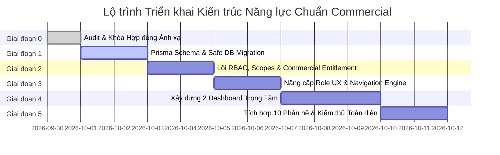

# KẾ HOẠCH THỰC THI NÂNG CẤP KIẾN TRÚC ROLE & CAPABILITY (PRODUCTION & COMMERCIAL READY)

> **Mã kế hoạch:** `PLAN-2026-ROLE-CAPABILITY-01`  
> **Phiên bản:** `1.0.0` (Production & Commercial Specification)  
> **Ngày phê duyệt đề xuất:** 30/09/2026  
> **Hệ thống áp dụng:** `floraos-core` (Next.js 15, PostgreSQL, Prisma ORM, Clean Architecture)  
> **Căn cứ kiến trúc cốt lõi:**  
> - Đặc tả nâng cấp: [`docs/FLORAOS_CORE_ROLE_CAPABILITY_ARCHITECTURE_UPGRADE.md`](file:///Users/tuan/Projects/floraos-core/docs/FLORAOS_CORE_ROLE_CAPABILITY_ARCHITECTURE_UPGRADE.md)  
> - Báo cáo layout & chức năng Admin: [`docs/dac-ta/BAO_CAO_LAYOUT_VA_CHUC_NANG_ADMIN.md`](file:///Users/tuan/Projects/floraos-core/docs/dac-ta/BAO_CAO_LAYOUT_VA_CHUC_NANG_ADMIN.md)  
> - Hiến pháp Role UX: [`docs/dac-ta/03b-role-ux.md`](file:///Users/tuan/Projects/floraos-core/docs/dac-ta/03b-role-ux.md)  
> - Danh mục năng lực & RBAC: [`docs/dac-ta/02-function-catalog.md`](file:///Users/tuan/Projects/floraos-core/docs/dac-ta/02-function-catalog.md) & [`src/core/rbac/capability-catalog.ts`](file:///Users/tuan/Projects/floraos-core/src/core/rbac/capability-catalog.ts)  
> - Kiến trúc mục tiêu FloraOS SaaS V2: [`docs/kien-truc/FLORAOS_SAAS_TARGET_ARCHITECTURE_V2.md`](file:///Users/tuan/Projects/floraos-core/docs/kien-truc/FLORAOS_SAAS_TARGET_ARCHITECTURE_V2.md)  

---

## 1. MỤC TIÊU VÀ TUYÊN NGÔN CHUẨN MỰC (PRODUCTION & COMMERCIAL STANDARDS)

### 1.1. Mục tiêu Cốt lõi
Chuyển đổi toàn diện hệ thống phân tầng quản trị và phân quyền của FloraOS Core từ mô hình chuỗi truyền thống sang mô hình nền tảng điện hoa thương mại hiện đại:
- **Từ mô hình cũ:** `PLATFORM` | `ONE_STORE` | `CHAIN`
- **Sang mô hình chuẩn thương mại:** `PLATFORM` | `STORE` | `FLOWER_NETWORK`

Với 3 vai trò cấp cao (Top-Level Roles) phân định ranh giới trách nhiệm tuyệt đối:
1. **Platform Admin (`platform_admin`)** — Quản trị hạ tầng, tenant, AI quota và an toàn bảo mật toàn nền tảng SaaS.
2. **Store Admin (`store_admin`)** — Trực tiếp sử dụng toàn bộ năng lực FloraOS để vận hành và thúc đẩy tăng trưởng một cửa hàng hoa độc lập.
3. **Điện hoa Admin (`flower_network_admin`)** — Siêu vai trò điều hành, giám sát, quản lý và thực thi trên toàn bộ mạng lưới điện hoa đa chi nhánh và xưởng đối tác.

---

### 1.2. Tuyên ngôn Chuẩn mực "Production & Commercial Ready"
Mọi dòng code, cấu trúc CSDL và giao diện người dùng sinh ra từ kế hoạch này bắt buộc phải thỏa mãn 7 tiêu chí vàng:
1. **Zero Breaking Changes & Zero Downtime:** Toàn bộ người dùng hiện tại (cả gói `EXPERIENCE`, `SINGLE`, `CHAIN`) không bị gián đoạn hoạt động; có cơ chế tương thích ngược (fallback/alias layer) trong toàn bộ quá trình chuyển đổi.
2. **Tuyệt đối Cách ly Tenant (100% Tenant Isolation):** Mọi truy vấn của `Store Admin` và `Điện hoa Admin` đều phải đi qua `TenantContext` và gác bằng `scopedWhere()`. Cấm tuyệt đối rò rỉ dữ liệu chéo giữa các cửa hàng hoặc giữa các đối tác mạng lưới.
3. **Phân định Rạch ròi Phân quyền (Authorization) và Hạn mức Gói cước (Commercial Entitlement):** Phân biệt người dùng *có quyền làm* (Role/Capability) với tổ chức *được phép dùng tính năng đó theo gói dịch vụ đã trả tiền* (Plan Entitlement).
4. **Bảo tồn Tuyệt đối các Vai Chuyên môn:** Giữ nguyên 100% các vai chuyên môn (`sales`, `crm`, `coordinator`, `product_manager`, `customer_service`, `marketing`, `florist`, `quality_control`...). Không xóa bỏ hay làm suy yếu bất kỳ vai nào; tổ chức chúng thành các không gian làm việc chuyên sâu (Specialist Workspaces) bên dưới các vai cấp cao.
5. **Hiệu năng & Web Vitals:** Tải trang P95 < 200ms; không có N+1 queries; pagination bắt buộc với limit tối đa 100; truy vấn mạng lưới sử dụng batching và indexing tối ưu.
6. **Tuân thủ Tuyệt đối 12 SaaS Anti-Patterns:** Không `console.log` production, không hardcode secret, không ép kiểu unchecked `as`, không dùng `any`, không fetch trực tiếp trong Client Components.
7. **Bản địa hóa 100% Ngành Hoa Việt Nam & Chuẩn UX 03a:** Không hiển thị mã kỹ thuật (`M01a`, `CHAIN`, `RBAC`, `P2`...) lên giao diện người dùng; tuân thủ nghiêm ngặt bảng token ngữ nghĩa `globals.css` (UX Lint R1, R2, R5, R8).

---

## 2. MA TRẬN ÁNH XẠ KIẾN TRÚC HIỆN TRẠNG ↔ MỤC TIÊU (MAPPING CONTRACT)

```text
┌────────────────────────────────────────────────────────────────────────┐
│                              FLORAOS CORE                              │
├────────────────────────────────────────────────────────────────────────┤
│ 1. USER                                                                │
│    └─► 2. SCOPE (PLATFORM | STORE | FLOWER_NETWORK)                   │
│          └─► 3. ROLE (Top-Level Role & Functional Roles)               │
│                └─► 4. CAPABILITIES (A1 ... Y10)                        │
│                      └─► 5. COMMERCIAL ENTITLEMENT (Gói dịch vụ)       │
│                            └─► 6. ACTION & DATA SCOPE (Resource)       │
└────────────────────────────────────────────────────────────────────────┘
```

### 2.1. Ma trận Chuyển đổi Scope & Role
| Tiêu chí | Mô hình Hiện tại | Mô hình Mục tiêu | Chiến lược Chuyển đổi An toàn |
| :--- | :--- | :--- | :--- |
| **Nhóm Scope CSDL** | `SINGLE`, `CHAIN`, `EXPERIENCE` | `STORE`, `FLOWER_NETWORK`, `EXPERIENCE` | Bổ sung giá trị enum mới vào Postgres, giữ `SINGLE`/`CHAIN` làm alias chuyển tiếp. |
| **Nhóm Role UX** | `PLATFORM`, `ONE_STORE`, `CHAIN` | `PLATFORM`, `STORE`, `FLOWER_NETWORK` | Cập nhật `RoleUxGroup = "PLATFORM" \| "STORE" \| "FLOWER_NETWORK" \| "ONE_STORE" \| "CHAIN"`. |
| **Vai Quản trị Nền tảng** | `platform_admin` (Scope: `PLATFORM`) | `platform_admin` (Scope: `PLATFORM`) | **Giữ nguyên 100%**. Console `/van-hanh`, bảng `platform_operators`. |
| **Vai Quản trị Cửa hàng** | `store_manager` (Gắn role `dieu_hanh`) | `store_admin` (Gắn role `dieu_hanh`) | Thiết lập alias 2 chiều `store_manager` ↔ `store_admin` trong `role-ux-catalog.ts`. |
| **Vai Quản trị Điện hoa** | `ceo` / `manager` (`CHAIN` - nợ #165) | `flower_network_admin` (Scope: `FLOWER_NETWORK`) | Tạo siêu vai trò mới, tích hợp 4 tầng năng lực và 10 phân hệ nghiệp vụ. |
| **Các Vai Chuyên môn** | 12 vai chuyên môn hiện hữu | 12 vai chuyên môn hiện hữu | **Bảo tồn 100%**. Gắn dưới Scope `STORE` hoặc `FLOWER_NETWORK`. |

---

## 3. LỘ TRÌNH THỰC THI 6 GIAI ĐOẠN (PHASED EXECUTION ROADMAP)



---

### GIAI ĐOẠN 0: AUDIT, ĐẶC TẢ HỢP ĐỒNG ÁNH XẠ & TƯƠNG THÍCH NGƯỢC
> **Mục tiêu:** Đảm bảo 100% các điểm tiếp xúc trong codebase không bị lỗi hồi quy khi cập nhật từ vựng kiến trúc.

#### Các nhiệm vụ chi tiết:
1. **Rà soát toàn bộ điểm xuất hiện của các định danh cũ:**
   - Scan toàn bộ `store_manager`, `ONE_STORE`, `CHAIN` trong `src/` và `tests/`.
   - Xác định danh sách các tệp phụ thuộc: [`role-ux-catalog.ts`](file:///Users/tuan/Projects/floraos-core/src/modules/organization/domain/role-ux-catalog.ts), [`nav-model.ts`](file:///Users/tuan/Projects/floraos-core/src/components/layout/nav-model.ts), [`session.tsx`](file:///Users/tuan/Projects/floraos-core/src/lib/session.tsx), [`page.tsx`](file:///Users/tuan/Projects/floraos-core/src/app/(app)/page.tsx).
2. **Xây dựng Adapter Tương thích Ngược (Backward-Compatibility Bridge):**
   - Viết hàm chuẩn hóa `normalizeRoleUxKey(key: string): RoleUxKey` tự động chuyển đổi `store_manager` ➔ `store_admin`.
   - Viết hàm chuẩn hóa `normalizeRoleUxGroup(group: string): RoleUxGroup` tự động ánh xạ `ONE_STORE` ➔ `STORE`, `CHAIN` ➔ `FLOWER_NETWORK`.
3. **Tiêu chuẩn hoàn thành Giai đoạn 0:**
   - [ ] Bảng tra cứu tương thích ngược được viết dưới dạng Unit Test độc lập và pass 100%.

---

### GIAI ĐOẠN 1: NÂNG CẤP SCHEMA CSDL & MIGRATION AN TOÀN (DATABASE LAYER)
> **Mục tiêu:** Mở rộng các enum và bảng dữ liệu trong PostgreSQL qua Prisma Migration mà không khóa bảng và không làm mất bất kỳ bản ghi nào.

#### Các nhiệm vụ chi tiết:
1. **Cập nhật [`prisma/schema.prisma`](file:///Users/tuan/Projects/floraos-core/prisma/schema.prisma):**
   - Mở rộng enum `organization_type`:
     ```prisma
     enum organization_type {
       EXPERIENCE
       SINGLE
       STORE           // Chuẩn hóa tên gọi mới
       CHAIN           // Giữ nguyên tương thích ngược dữ liệu cũ
       FLOWER_NETWORK  // Kiến trúc mạng lưới điện hoa
     }
     ```
   - Mở rộng enum `capability_scope`:
     ```prisma
     enum capability_scope {
       ORGANIZATION
       BRANCH
       STORE
       FLOWER_NETWORK
     }
     ```
2. **Tạo Migration an toàn với Prisma:**
   - Sử dụng cờ `--create-only` để kiểm tra script SQL:
     ```bash
     npx prisma migrate dev --create-only --name add_flower_network_and_store_architecture
     ```
   - Xác nhận SQL migration chỉ dùng cú pháp `ALTER TYPE ... ADD VALUE IF NOT EXISTS`, tuyệt đối không dùng lệnh `DROP TYPE` hoặc `RENAME COLUMN`.
3. **Cập nhật Hạt giống Dữ liệu (Seed Data):**
   - Thêm vai hệ thống `flower_network_admin` vào danh mục `system-roles.ts`.
   - Thiết lập bản ghi mặc định cho `flower_network_admin` trong bảng `roles` (`organization_id = null`, `is_system = true`).
4. **Tiêu chuẩn hoàn thành Giai đoạn 1:**
   - [ ] Lệnh `npx prisma db push` hoặc `npx prisma migrate deploy` chạy thành công trên local/staging.
   - [ ] Bộ test cách ly `npm run test:tenant` xanh 100%.

---

### GIAI ĐOẠN 2: NÂNG CẤP LÕI RBAC, SCOPES & CỔNG FEATURE ENTITLEMENT
> **Mục tiêu:** Hoàn thiện 4 tầng năng lực (*Execution, Supervision, Management, Command*) và phân định rạch ròi giữa Quyền (Role) và Gói cước (Entitlement).

#### Các nhiệm vụ chi tiết:
1. **Bổ sung Danh mục Mã Năng lực Mạng lưới Điện hoa ([`src/core/rbac/capability-catalog.ts`](file:///Users/tuan/Projects/floraos-core/src/core/rbac/capability-catalog.ts)):**
   - **Nhóm W — Quản trị Đối tác Mạng lưới (Partner Network):**
     - `W1` (`partner.onboard`): Tiếp nhận và kích hoạt đối tác xưởng ngoài mới.
     - `W2` (`partner.tier.manage`): Phân hạng đối tác, định mức năng lực cắm hoa/ngày.
     - `W3` (`partner.sla.monitor`): Giám sát và đánh giá chất lượng thực hiện SLA đối tác.
     - `W4` (`partner.policy.update`): Ban hành chính sách phân bổ đơn và tỷ lệ thưởng phạt.
   - **Nhóm X — Kiểm soát Chất lượng Toàn Mạng lưới (Quality Control & Exception):**
     - `X1` (`qc.inspection.run`): Kiểm tra ảnh thành phẩm, đối chiếu tiêu chuẩn mẫu hoa.
     - `X2` (`qc.rework.dispatch`): Yêu cầu cắm lại hoặc đổi xưởng thực hiện khẩn cấp.
     - `X3` (`qc.metrics.view`): Báo cáo tỷ lệ lỗi hoa hỏng và khiếu nại khách hàng.
   - **Nhóm Y — Tài chính & Đối soát Mạng lưới (Finance & Inter-Partner Reconciliation):**
     - `Y1` (`finance.reconciliation.view`): Bảng đối soát công nợ chi nhánh và đối tác.
     - `Y2` (`finance.payout.approve`): Duyệt lệnh thanh toán tiền công/hoa hồng đối tác.
     - `Y3` (`finance.commission.manage`): Thiết lập mức hoa hồng theo địa bàn và loại hoa.
   - **Nhóm N — Điều hành Cấp cao (Command & Exceptional Override):**
     - `N1` (`network.dispatch.emergency`): Cưỡng chế điều chuyển đơn hàng giữa các vùng.
     - `N2` (`network.priority.override`): Đổi thứ tự ưu tiên sản xuất trên toàn hệ thống.
2. **Cập nhật Lớp Trần cứng (Hard Cap Layer - Lớp 3):**
   - Đảm bảo các quyền nhạy cảm mạng lưới (`Y2`, `Y3`, `N1`, `N2`) được gác cứng vào `hardCap: ["flower_network_admin", "dieu_hanh"]`.
3. **Xây dựng Cổng Kiểm soát Feature Entitlement ([`src/core/entitlements/entitlement-service.ts`](file:///Users/tuan/Projects/floraos-core/src/core/entitlements/)):**
   - Tạo hàm chuẩn `checkFeatureEntitlement(org: Organization, featureKey: string): boolean`.
   - Kết hợp kiểm tra 2 lớp tại API Gateways:
     ```typescript
     export async function requireFeatureAccess(ctx: TenantContext, code: string, feature: string) {
       requireCapability(ctx, code) // Lớp 1: Role/Capability Authorization
       await requirePlanEntitlement(ctx.organizationId, feature) // Lớp 2: Commercial Plan Entitlement
     }
     ```
4. **Tiêu chuẩn hoàn thành Giai đoạn 2:**
   - [ ] Bộ test `src/core/rbac/capability-catalog.test.ts` bổ sung kiểm tra các mã mới, đạt 100% pass.
   - [ ] Test case kiểm tra Entitlement: Người dùng có quyền nhưng gói chưa kích hoạt tính năng sẽ bị chặn với mã lỗi `ENTITLEMENT_REQUIRED`.

---

### GIAI ĐOẠN 3: NÂNG CẤP ROLE UX CATALOG, ĐIỀU HƯỚNG & SESSION ENGINE
> **Mục tiêu:** Cập nhật khuôn trải nghiệm của 3 vai cấp cao và đồng bộ toàn bộ logic điều hướng đa nền tảng.

#### Các nhiệm vụ chi tiết:
1. **Cập nhật [`src/modules/organization/domain/role-ux-catalog.ts`](file:///Users/tuan/Projects/floraos-core/src/modules/organization/domain/role-ux-catalog.ts):**
   - Định nghĩa chính thức vai `store_admin`:
     - `key: "store_admin"` (hỗ trợ đọc alias `store_manager`).
     - `label: "Quản trị cửa hàng"` (ngữ cảnh: "Chủ cửa hàng").
     - `group: "STORE"`.
     - `primaryPhilosophy: "Store Growth & Operations Command Center"`.
     - `primaryQuestion: "Tôi cần làm gì để cửa hàng phát triển hôm nay?"`.
     - `homepage: "STORE_GROWTH_CENTER"`.
     - `status: "AVAILABLE"`.
   - Định nghĩa chính thức vai `flower_network_admin`:
     - `key: "flower_network_admin"`.
     - `label: "Điện hoa Admin"` (ngữ cảnh: "Trung tâm điều hành điện hoa").
     - `group: "FLOWER_NETWORK"`.
     - `primaryPhilosophy: "Real-time Network Command & Operations Orchestration"`.
     - `primaryQuestion: "Toàn bộ hệ thống điện hoa đang hoạt động thế nào và tôi cần can thiệp ở đâu?"`.
     - `homepage: "FLOWER_NETWORK_COMMAND_CENTER"`.
     - `status: "AVAILABLE"`.
2. **Cập nhật Mô hình Điều hướng [`src/components/layout/nav-model.ts`](file:///Users/tuan/Projects/floraos-core/src/components/layout/nav-model.ts):**
   - Xây dựng thanh điều hướng ưu tiên riêng cho `Store Admin` (§19):
     `navPriority: ["/market-intelligence", "/san-pham", "/creative-studio", "/hoi-thoai", "/don-hang"]`.
   - Xây dựng thanh điều hướng ưu tiên riêng cho `Điện hoa Admin` (§19):
     `navPriority: ["/dieu-phoi", "/don-hang", "/san-pham", "/khach-hang", "/so-lieu"]`.
3. **Cập nhật Giao diện Danh mục Vai [`src/app/(app)/vai-tro/page.tsx`](file:///Users/tuan/Projects/floraos-core/src/app/(app)/vai-tro/page.tsx):**
   - Nhóm lại giao diện thành 3 cột/khối thương mại:
     1. **Quản trị Nền tảng (Platform SaaS)**: `platform_admin`.
     2. **Quản trị & Phát triển Cửa hàng (Store Business)**: `store_admin`, `sales`, `crm`, `lead_marketing`, `florist`.
     3. **Mạng lưới Vận hành Điện hoa (Flower Network)**: `flower_network_admin`, `coordinator`, `customer_service`, `product_manager`, `quality_control`, `partner_manager`, `finance_accounting`.
4. **Tiêu chuẩn hoàn thành Giai đoạn 3:**
   - [ ] `role-ux-catalog.test.ts` đạt 100% pass với cấu trúc 3 Top-Level Roles mới.
   - [ ] Menu điều hướng desktop/mobile hiển thị đúng thứ tự ưu tiên của từng vai.

---

### GIAI ĐOẠN 4: THIẾT KẾ & XÂY DỰNG 2 DASHBOARD TRỌNG TÂM CHUẨN THƯƠNG MẠI
> **Mục tiêu:** Xây dựng 2 Dashboard trung tâm trả lời chính xác câu hỏi cốt lõi của người điều hành và đạt chuẩn thẩm mỹ cao cấp.

#### Các nhiệm vụ chi tiết:
1. **Xây dựng Dashboard Store Admin: `Store Growth Center`:**
   - **Tệp component:** [`src/components/dashboard/store-growth-center.tsx`](file:///Users/tuan/Projects/floraos-core/src/components/dashboard/store-growth-center.tsx).
   - **Bố cục 3 khối tăng trưởng:**
     - **Khối 1 — Cơ hội Kinh doanh & Thị trường (P0 Growth Opportunities):** Tích hợp Market Intelligence, hiển thị các mẫu hoa đang bắt trend tuần này, gợi ý giá bán và nút tạo chiến dịch 1-click.
     - **Khối 2 — Chỉ số Sẵn sàng Sản phẩm & Chiến dịch (P1 Readiness):** Thống kê số lượng sản phẩm chưa có ảnh chuẩn, bài viết chờ duyệt, trạng thái credit AI còn lại.
     - **Khối 3 — AI Sales & Phễu Chuyển đổi Khách hàng (P1 Conversion):** Tỷ lệ chốt đơn tự động của AI chatbot, danh sách khách hàng có ngày kỷ niệm trong 7 ngày tới cần gửi tin nhắn tri ân.
2. **Xây dựng Dashboard Điện hoa Admin: `Flower Network Command Center`:**
   - **Tệp component:** [`src/components/dashboard/flower-network-command-center.tsx`](file:///Users/tuan/Projects/floraos-core/src/components/dashboard/flower-network-command-center.tsx).
   - **Bố cục 4 tầng năng lực chuẩn hóa:**
     - **Tầng 4 — Điều hành Khẩn cấp (Command):** Thanh radar đỏ cảnh báo đơn hàng quá hạn SLA, rủi ro thiếu hoa cục bộ tại các tỉnh/thành, nút điều chuyển xưởng khẩn cấp.
     - **Tầng 3 — Quản lý Mạng lưới (Management):** Thống kê năng lực tiếp nhận đơn của các xưởng đối tác (`partners.capacity_daily`), đánh giá chất lượng (`rating`), cảnh báo quá tải.
     - **Tầng 2 — Giám sát Tiến trình (Supervision):** Luồng trạng thái đơn 5 chặng (Tiếp nhận ➔ Phân bổ ➔ Cắm hoa ➔ Duyệt QC ➔ Giao hàng).
     - **Tầng 1 — Thực thi Tác vụ (Execution):** Bảng danh sách đơn hàng chờ phân công, nút duyệt ảnh thành phẩm do thợ gửi lên.
3. **Cập nhật Định tuyến Tuyến Trang chủ ([`src/app/(app)/page.tsx`](file:///Users/tuan/Projects/floraos-core/src/app/(app)/page.tsx)):**
   - Nhận diện `roleUx.homepage`:
     - `STORE_GROWTH_CENTER` ➔ Trả về `<StoreGrowthCenter />`.
     - `FLOWER_NETWORK_COMMAND_CENTER` ➔ Trả về `<FlowerNetworkCommandCenter />`.
4. **Tiêu chuẩn hoàn thành Giai đoạn 4:**
   - [ ] Giao diện tuân thủ 100% token màu semantic trong `globals.css` (Không dùng Tailwind raw colors, không dùng font size tùy ý).
   - [ ] Không có dữ liệu giả (mock data); nếu chưa có dữ liệu thật thì hiển thị trạng thái `DATA GAP` / `EMPTY STATE` chuẩn mực.

---

### GIAI ĐOẠN 5: TÍCH HỢP 10 PHÂN HỆ NGHIỆP VỤ ĐIỆN HOA & NGHIỆM THU TOÀN DIỆN
> **Mục tiêu:** Kết nối thông suốt dữ liệu thực tế giữa 10 phân hệ nghiệp vụ và hệ thống báo cáo kiểm thử tự động.

#### Các nhiệm vụ chi tiết:
1. **Kết nối Dữ liệu Mạng lưới Thật vào Command Center:**
   - Kết nối `order_coordinations` và `order_exceptions` qua `CoordinatorRepository`.
   - Kết nối danh bạ đối tác xưởng ngoài từ bảng `partners`.
   - Kết nối bảng duyệt ảnh sản phẩm thực tế từ `order_qc_records`.
2. **Triển khai Bộ Kiểm thử Tự động Toàn diện (Full Test Suite):**
   - **Unit Tests:** Kiểm tra tính toàn vẹn của logic cấp quyền và danh mục Role UX.
   - **Tenant Isolation Tests (`npm run test:tenant`):** Bắt buộc vượt qua 100% các kịch bản thử nghiệm cách ly dữ liệu giữa các cửa hàng và mạng lưới điện hoa.
   - **UX Lint (`npm run lint:ux -- --check`):** Xác nhận 0 vi phạm R1 (Tailwind color), R2 (arbitrary font size), R5 (interactive onClick), R8 (technical codes).
   - **Typecheck (`npx tsc --noEmit`):** Sạch 100% lỗi TypeScript.
3. **Cập nhật Toàn diện Hệ thống Tài liệu SSOT:**
   - Cập nhật [`docs/dac-ta/03b-role-ux.md`](file:///Users/tuan/Projects/floraos-core/docs/dac-ta/03b-role-ux.md) ghi nhận chính thức mô hình 3 Top-Level Roles.
   - Cập nhật [`docs/dac-ta/02-function-catalog.md`](file:///Users/tuan/Projects/floraos-core/docs/dac-ta/02-function-catalog.md) bổ sung mã năng lực nhóm W, X, Y, N.
   - Cập nhật [`docs/kien-truc/TRANG_THAI.md`](file:///Users/tuan/Projects/floraos-core/docs/kien-truc/TRANG_THAI.md) và đóng các nợ kỹ thuật liên quan đến phân vai chuỗi (#163, #165).
4. **Tiêu chuẩn hoàn thành Giai đoạn 5:**
   - [ ] Toàn bộ 820+ bài test tự động của hệ thống chạy xanh.
   - [ ] Hệ thống tài liệu khớp 100% với mã nguồn thực tế.

---

## 4. MA TRẬN PHÂN TÍCH RỦI RO & PHƯƠNG ÁN PHÒNG NGỪA (RISK & MITIGATION)

| Rủi ro Kỹ thuật / Nghiệp vụ | Mức độ | Hậu quả tiềm ẩn | Biện pháp Phòng ngừa & Khắc phục |
| :--- | :---: | :--- | :--- |
| **Gãy tương thích ngược khi đổi tên `store_manager`** | **CAO** | Lỗi render trắng trang cho các tài khoản đang đăng nhập | Duy trì alias `store_manager` trỏ về `store_admin` trong tối thiểu 2 chu kỳ phát hành; kiểm thử hồi quy 100% route. |
| **Rò rỉ dữ liệu đơn giữa các đối tác trong mạng lưới** | **CỰC CAO** | Đối tác A xem được doanh thu và thông tin khách hàng của đối tác B | Gác chặt repository bằng `partner_id` và `organization_id`; mọi query mạng lưới phải thông qua `scopedWhere()`. |
| **Lệch cấu trúc enum CSDL khi migration production** | **TRUNG BÌNH** | Lỗi khóa bảng Postgres hoặc fail Prisma migration | Áp dụng quy trình Prisma safe migration: chỉ dùng `ADD VALUE IF NOT EXISTS`, test migration trên staging database trước. |
| **Người dùng nhầm lẫn giữa Store Admin và Điện hoa Admin** | **TRUNG BÌNH** | Giao diện hiển thị quá nhiều tính năng không thuộc phạm vi cửa hàng đơn | Tách biệt triệt để câu hỏi định vị UX và danh mục điều hướng (§19 & §20); Store Admin chỉ thấy công cụ tăng trưởng cửa hàng. |

---

## 5. TIÊU CHÍ NGHIỆM THU HOÀN THÀNH (DEFINITION OF DONE - DOD)

Hệ thống nâng cấp được nghiệm thu chính thức đạt chuẩn **Production & Commercial Ready** khi và chỉ khi:

- [ ] **Kiến trúc Top-Level:** Có đúng 3 Top-Level Roles: `platform_admin` (Scope: `PLATFORM`), `store_admin` (Scope: `STORE`), `flower_network_admin` (Scope: `FLOWER_NETWORK`).
- [ ] **Bảo tồn Chuyên môn:** Đầy đủ 12 vai chuyên môn hiện hữu không bị xóa, hoạt động ổn định trong các workspace chuyên biệt.
- [ ] **Cơ sở dữ liệu:** Enum `organization_type` và `capability_scope` được cập nhật an toàn; migration không làm mất dữ liệu.
- [ ] **Phân quyền & Entitlement:** Cơ chế kiểm tra quyền đa tầng `Role ➔ Scope ➔ Capability ➔ Entitlement ➔ Resource` hoạt động thông suốt.
- [ ] **Dashboards Thương mại:**
  - `Store Growth Center` hoạt động tại `/` cho Store Admin, phản ánh đúng bức tranh tăng trưởng kinh doanh.
  - `Flower Network Command Center` hoạt động tại `/` cho Điện hoa Admin, phản ánh đầy đủ 4 tầng năng lực vận hành mạng lưới.
- [ ] **Điều hướng & UX:** Menu điều hướng sắp xếp đúng ưu tiên; 100% nhãn tiếng Việt ngành hoa; 0 vi phạm UX Lint R1–R8.
- [ ] **Cách ly Dữ liệu:** `npm run test:tenant` xanh 100%.
- [ ] **Kiểm thử Toàn hệ thống:** `npm test` xanh 100% (toàn bộ test unit, integration và domain).
- [ ] **TypeScript:** `npx tsc --noEmit` hoàn toàn sạch lỗi (0 errors).
- [ ] **Tài liệu SSOT:** Đồng bộ hoàn tất `03b-role-ux.md`, `02-function-catalog.md`, `TRANG_THAI.md`, `00-DOCUMENTATION-REGISTRY.yaml`.
